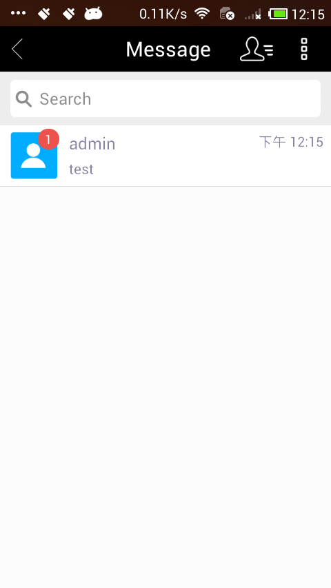
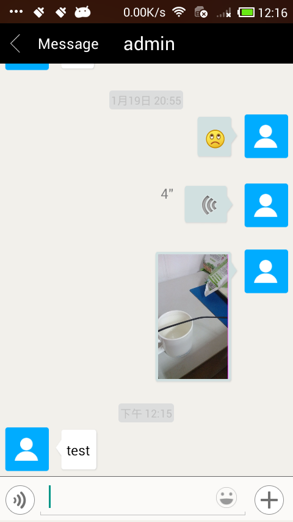

### easemob-demo

这是我在接入环信过程中，自己参考官方文档写的一个demo，项目中需要什么功能我会现在这个demo中实现，然后集成到项目中。这个demo比较小适合参考。

环信官网现在有两个demo，一个是演示SDK功能的demo，很全面但是却没有使用其EaseUI库；另一个是EaseUI集成演示库。

### 说明

* 环信的的标题栏是在XML文件中用布局模拟的，我将其替换成了`Toolbar`实现，以支持标准的菜单外观和行文。